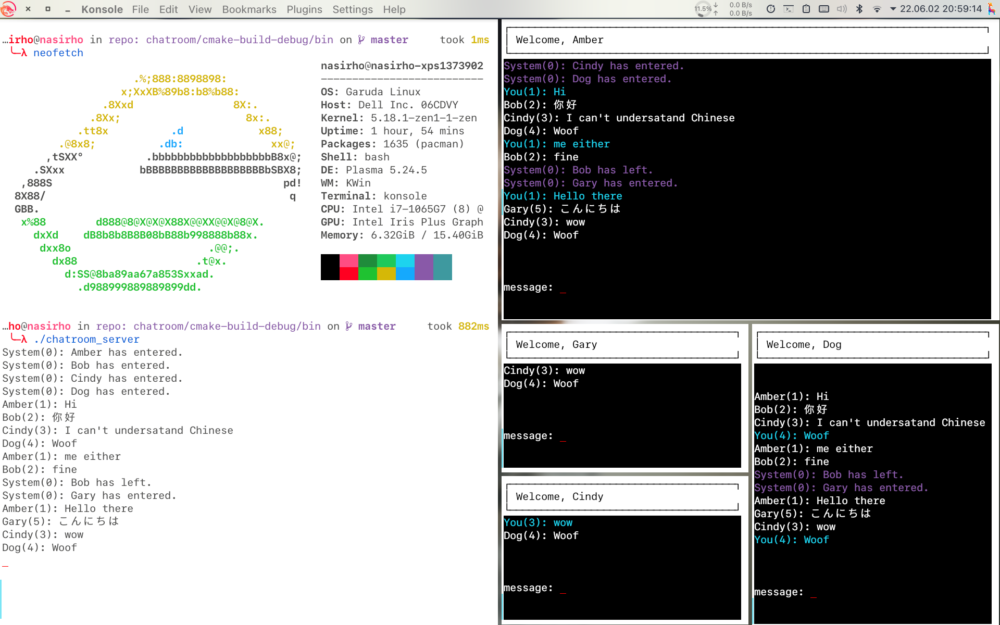

# Linux_Socket_Practice_Chatroom
linux socket programming practice -- a more to more chatroom implement by cpp

## Build
### Dependency
- Ubuntu 18.04
  - build-essential
  - cmake (>3.8)
  - libncurses-dev
  - libncursesw5-dev
```shell
sudo apt install build-essential cmake libncurses-dev libncursesw5-dev
```
- Arch
  - base-devel
  - cmake
  - ncurses
```shell
sudo pacman -S base-devel cmake ncurses
```
### Compile
1. clone lastest version from the repository
```shell
git clone https://github.com/nasirHo/Linux_Socket_Practice_Chatroom
```
2. cd to this directory
3. generate cmake configuration
```sh
cmake .
```
3. build
```sh
cmake --build .
```
4. You can find executable in bin directory
```shell
cd bin
```
## Usage
1. Start the server
```sh
./chatroom_server
```
2. Start the client
```sh
./chatroom_client_ncures
```
3. Enter your name

4. Start Chatting

5. Type /quit to leave
## Limitation
~~- Chinese word cannot display~~
- Clients count has limit
- UI might wrong when terminal resized
  - the behavior now is leave chat
